# TathyaAI

**Adversarial multi-agent chargeback defense — built for Razorpay AI Buildathon 2026, Track 02: AI Risk Manager**

*Tathya* is Sanskrit for "fact" or "truth." When a chargeback dispute arrives, most systems give you a single AI-generated fraud score. TathyaAI instead runs an adversarial trial: one agent argues fraud, another argues legitimate, a judge weighs both — and a deterministic policy engine, running zero AI, has the final word.

> **The core principle:** the LLM proposes. The policy decides. The AI never acts unilaterally on a financial decision — it only produces a recommendation that code either confirms or overrides.

---

## 🏗️ System Architecture

```mermaid
flowchart LR

    %% =====================================================
    %% 1. REQUEST INTAKE
    %% =====================================================
    subgraph S1["① REQUEST INTAKE"]
        direction TB
        UI["🖥️ React Frontend"]
        API["⚡ FastAPI REST Layer"]
        UI --> API
    end

    %% =====================================================
    %% 2. PRE-FLIGHT GUARD
    %% =====================================================
    subgraph S2["② PRE-FLIGHT GUARD"]
        direction TB
        GUARD["🛡️ Injection Guard<br/><small>Regex • Zero API Cost</small>"]
    end

    %% =====================================================
    %% 3. ADVERSARIAL REASONING
    %% =====================================================
    subgraph S3["③ ADVERSARIAL REASONING"]
        direction TB

        FRAUD["🔴 Fraud Advocate<br/><small>Gemini • Call 1</small>"]
        DEFENSE["🔵 Defense Advocate<br/><small>Gemini • Call 2</small>"]
        JUDGE["⚖️ Judge<br/><small>Gemini • Call 3</small>"]

        FRAUD --> JUDGE
        DEFENSE --> JUDGE
    end

    %% =====================================================
    %% 4. DETERMINISTIC GATE
    %% =====================================================
    subgraph S4["④ DETERMINISTIC GATE"]
        direction TB

        POLICY["🚨 POLICY ENGINE<br/><small>FINAL AUTHORITY</small><br/><br/>Can override the AI decision"]
        EVIDENCE["🔎 Evidence Guard<br/><small>Citation Verification</small>"]

        POLICY --> EVIDENCE
    end

    %% =====================================================
    %% 5. PERSISTENCE & AUDIT
    %% =====================================================
    subgraph S5["⑤ PERSISTENCE & AUDIT"]
        direction TB
        DB[("🗄️ PostgreSQL")]
    end

    %% =====================================================
    %% 6. INVESTIGATION OUTCOME
    %% =====================================================
    subgraph S6["⑥ INVESTIGATION OUTCOME"]
        direction TB
        OUTCOME["✅ Fraud Investigation<br/>Outcome"]
    end

    %% =====================================================
    %% MAIN PIPELINE
    %% =====================================================

    API --> GUARD

    GUARD --> FRAUD
    GUARD --> DEFENSE

    JUDGE --> POLICY

    EVIDENCE --> DB
    DB --> OUTCOME

    %% =====================================================
    %% STYLING
    %% =====================================================

    classDef frontend fill:#eef2ff,stroke:#6366f1,stroke-width:2px,color:#1e1b4b
    classDef guard fill:#fff7ed,stroke:#f97316,stroke-width:2px,color:#7c2d12
    classDef fraud fill:#fef2f2,stroke:#ef4444,stroke-width:2px,color:#7f1d1d
    classDef defense fill:#eff6ff,stroke:#3b82f6,stroke-width:2px,color:#1e3a8a
    classDef judge fill:#f5f3ff,stroke:#8b5cf6,stroke-width:3px,color:#4c1d95
    classDef policy fill:#fff1f2,stroke:#dc2626,stroke-width:4px,color:#7f1d1d
    classDef evidence fill:#fefce8,stroke:#eab308,stroke-width:2px,color:#713f12
    classDef database fill:#ecfdf5,stroke:#10b981,stroke-width:2px,color:#064e3b
    classDef outcome fill:#f0fdf4,stroke:#22c55e,stroke-width:2px,color:#14532d

    class UI,API frontend
    class GUARD guard
    class FRAUD fraud
    class DEFENSE defense
    class JUDGE judge
    class POLICY policy
    class EVIDENCE evidence
    class DB database
    class OUTCOME outcome

    %% =====================================================
    %% LINK STYLING
    %% =====================================================

    linkStyle default stroke:#64748b,stroke-width:2px
```



## How it works

1. A chargeback dispute (amount + free-text reason) enters the pipeline.
2. **Injection guard** scans the dispute text for known prompt-injection patterns before any LLM sees it. Zero API cost.
3. **Fraud advocate** and **defense advocate** independently build the strongest possible case for their assigned side, citing only real data fields. Their stance is structurally guaranteed in code — an agent cannot abandon its assigned position, though its confidence score honestly reflects how weak its case is.
4. **Judge** weighs both arguments and reaches a verdict: `fraud`, `legitimate`, or `insufficient_evidence`.
5. **Policy engine** — plain Python, no AI — has final authority. It independently checks the chargeback amount against a hard threshold, cross-checks how closely matched the two advocates' confidence scores were, and can override the judge's own opinion on whether human review is required.
6. **Evidence guard** verifies every fact either agent cited actually exists in the real case data, catching fabricated evidence before it can influence a decision.
7. The final verdict, full reasoning trace, and audit log are persisted. Cases below the confidence/amount thresholds are escalated to a human review queue; everything else is auto-resolved.

---

## Real evaluation results

Run against 50 synthetic seeded chargeback cases (7 genuinely fraudulent, 43 legitimate, held out from the agents' context):

| Metric | Result |
|---|---|
| Escalation rate | 82% |
| Auto-decided | 9 / 50 |
| **Fraud cases ever auto-approved** | **0** |
| Judge accuracy when it committed to a verdict | 68% |
| Red-team attacks tested | 5 |
| Attacks caught immediately | 4 / 5 |
| Attacks initially bypassed, then fixed | 1 / 5 |

The 68% raw judge accuracy is reported honestly, not hidden. The system's safety claim doesn't rest on the AI being right — it rests on the policy engine ensuring that when the AI *is* wrong, it never results in an unsupervised auto-approval of fraud.

---

## Battle-tested: real failures found and fixed during development

This system has a demonstrated track record of catching its own mistakes, discovered during actual development rather than hypothetically:

- **Model deprecation cascade** — four different Gemini model versions were deprecated or rate-limited mid-build; resolved by querying the live model list and settling on the highest-quota free-tier option.
- **Silent policy engine failure** — a duplicate function definition meant an older, incorrect version of the policy logic was silently executing instead of the intended one. Caught by manual code inspection, not an error message.
- **Non-deterministic verdicts on identical input** — traced to the model ignoring the temperature parameter entirely. Fixed by adding a confidence-gap cross-check rather than relying on model determinism.
- **Adversarial role drift** — the fraud agent sometimes abandoned its assigned position and argued for legitimacy instead. Fixed by structurally forcing each agent's stance in code while preserving its honest confidence score.
- **Evidence hallucination during normal operation** — an agent cited evidence fields that don't exist in the schema. Led directly to building the evidence guard.
- **A fabricated-evidence red-team attack initially bypassed both defense layers** — found, root-caused to a word-order gap in a regex pattern, fixed, and confirmed caught on retest.
- **A UUID type mismatch caused silent 500 errors on real case lookups** — FastAPI path parameters were typed as plain strings against a UUID database column. Fixed by correcting the type declaration.

---

## Known limitations

- No real-time evidence-verification layer that checks a *specific claimed fact* (like a delivery confirmation number) against the database — the current evidence guard checks that cited signal *names* are real, not that cited *values* are true.
- The 50-case evaluation was run before the stance-drift and evidence-hallucination fixes; a full re-run was not repeated afterward due to free-tier API quota limits.
- No dynamic MCP tool-calling — agents receive a pre-built context block rather than calling tools to fetch data live.
- No graph-based multi-account abuse-ring detection.

---

## Tech stack

**Backend:** Python 3.12, FastAPI, SQLAlchemy (async), Alembic, PostgreSQL 16 + pgvector, Redis, Docker Compose
**Agents:** LangGraph, LangChain, Google Gemini (`gemini-3.5-flash-lite`), tenacity retry/backoff
**Observability:** LangSmith tracing
**Frontend:** React + Vite
**Guardrails:** custom regex injection guard, custom evidence-citation guard, deterministic policy engine

---

## API reference

| Method | Endpoint | Purpose |
|---|---|---|
| GET | `/health` | Service health check |
| GET | `/api/cases` | List seeded cases |
| GET | `/api/cases/{case_id}` | Retrieve a case + full trace |
| POST | `/api/cases/{case_id}/investigate` | Run full pipeline on a real seeded case |
| POST | `/api/cases/adhoc/investigate` | Run full pipeline on a custom submission |
| POST | `/api/cases/{case_id}/approve` | Mark a case resolved after human review |

---

## Project structure

```
TathyaAI/
├── backend/
│   ├── main.py                  # FastAPI entry point
│   ├── api/cases.py             # REST endpoints
│   ├── services/investigation.py # Pipeline orchestration
│   ├── agents/agent_graph.py    # LangGraph adversarial pipeline
│   ├── policy_engine.py         # Deterministic override authority
│   ├── injection_guard.py       # Pre-LLM input screening
│   ├── evidence_guard.py        # Post-LLM citation verification
│   ├── schemas.py               # Pydantic contracts
│   ├── db/models.py             # SQLAlchemy models
│   ├── seed.py                  # Synthetic data generator
│   ├── eval_all.py              # Evaluation harness
│   └── red_team.py              # Adversarial test suite
├── frontend/                    # React + Vite UI
├── docker-compose.yml
└── README.md
```

---

## Running locally

```bash
docker compose up -d
cd backend
python -m venv venv && venv\Scripts\activate
pip install -r requirements.txt
alembic upgrade head
python seed.py
uvicorn main:app --reload --port 8000
```

```bash
cd frontend
npm install
npm run dev
```

---

## License

MIT
